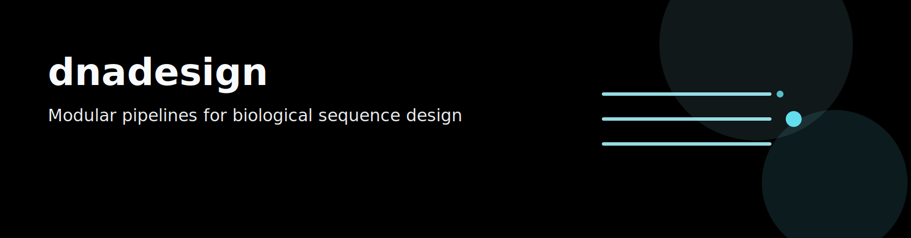

[](https://github.com/e-south/dnadesign/actions/workflows/ci.yaml)
[](https://codecov.io/gh/e-south/dnadesign)



`dnadesign` is a collection of modular bioinformatic pipelines and helper packages related to biological sequence design.
It bundles reusable tool packages for sequence generation, inference, optimization, clustering, and workflow operations.

---

## Quick paths

- [Start here](docs/start-here.md): workflow-first entrypoint.
- [Docs index](docs/README.md): task map and full navigation.
- [USR workflow map](src/dnadesign/usr/docs/operations/workflow-map.md): quick command chains for sync/bootstrap/chained runs.
- [USR iterative HPC sync loop](src/dnadesign/usr/docs/operations/hpc-agent-sync-flow.md): preflight/run/verify sync pattern.
- [USR chained DenseGen -> Infer workflow](src/dnadesign/usr/docs/operations/chained-densegen-infer-sync-demo.md): bidirectional dataset sync in a tool chain.

---

## Repository layout

```text
dnadesign/
├─ README.md            # High-level project documentation
├─ docs/                # Canonical runbooks and operational docs
├─ pyproject.toml
├─ uv.lock
├─ src/
│  └── dnadesign/
│      ├── permuter/    # in silico deep mutational scanning
│      ├── infer/       # model-agnostic inference (Evo2 adapter)
│      ├── densegen/    # string-packing nucleic acid assembly
│      ├── opal/        # active-learning engine
│      └── ...
└─ .github/workflows/   # CI checks
```

---

## Documentation

- [Start here](docs/start-here.md): lightweight workflow-first navigation.
- [Documentation index](docs/README.md): consolidated docs navigation.
- [Installation guide](docs/installation.md): environment bootstrap.
- [BU SCC operations guide](docs/bu-scc/README.md): cluster operations/runbooks.
- [Notify operations guide](docs/notify/README.md): webhook watcher/operator workflows.
- [Architecture map](ARCHITECTURE.md): repository boundaries, major flows, and invariants.
- [Reliability model](RELIABILITY.md): runtime/CI reliability behavior and runbook entrypoints.
- [Security policy](SECURITY.md): secrets, dependency locks, and incident handling.
- [Design principles](DESIGN.md): parse-at-boundaries, fail-fast, and decoupling contracts.
- [Planning map](PLANS.md): proposals, execution plans, ADRs, and journal workflow.
- [Quality score scaffold](QUALITY_SCORE.md): test/CI/docs quality dimensions and improvement path.
- [Developer documentation](docs/dev/README.md): maintainer notes, plans, and CI/test details.

---

## Available tools

| Tool | Description | Coverage |
| --- | --- | --- |
| [**usr**](src/dnadesign/usr) | Universal Sequence Record utilities for inspecting datasets and Parquet files. | [](https://codecov.io/gh/e-south/dnadesign?component=usr) |
| [**notify**](src/dnadesign/notify) | Tool-agnostic webhook notifier for batch runs (Slack, Discord, generic webhooks). | [](https://codecov.io/gh/e-south/dnadesign?component=notify) |
| [**densegen**](src/dnadesign/densegen) | DNA sequence design pipeline built on the [`dense-arrays`](https://github.com/e-south/dense-arrays) framework. | [](https://codecov.io/gh/e-south/dnadesign?component=densegen) |
| [**infer**](src/dnadesign/infer) | Model-agnostic wrapper for DNA/protein language models such as [Evo2](https://github.com/ArcInstitute/evo2/tree/main). | [](https://codecov.io/gh/e-south/dnadesign?component=infer) |
| [**opal**](src/dnadesign/opal) | [EVOLVEpro-style](https://www.science.org/doi/10.1126/science.adr6006) active-learning tool for DNA/protein sequence design campaigns. | [](https://codecov.io/gh/e-south/dnadesign?component=opal) |
| [**cluster**](src/dnadesign/cluster) | Parquet/CSV-first toolkit for clustering, UMAP visualization, and related analyses. | [](https://codecov.io/gh/e-south/dnadesign?component=cluster) |
| [**billboard**](src/dnadesign/billboard) | Quantifies regulatory diversity of dense-array DNA libraries generated by `densegen`. | [](https://codecov.io/gh/e-south/dnadesign?component=billboard) |
| [**libshuffle**](src/dnadesign/libshuffle) | Iterative subsampling workflow that uses `billboard` as its analysis engine. | [](https://codecov.io/gh/e-south/dnadesign?component=libshuffle) |
| [**nmf**](src/dnadesign/nmf) | Applies NMF to sequence libraries to identify higher-order TFBS combinations. | [](https://codecov.io/gh/e-south/dnadesign?component=nmf) |
| [**latdna**](src/dnadesign/latdna) | Pipeline for latent-space analysis of DNA sequences. | [](https://codecov.io/gh/e-south/dnadesign?component=latdna) |
| [**cruncher**](src/dnadesign/cruncher) | PWM-driven sequence optimization pipeline with pluggable parsers and optimizers. | [](https://codecov.io/gh/e-south/dnadesign?component=cruncher) |
| [**tfkdanalysis**](src/dnadesign/tfkdanalysis) | Pipeline for TFKD analysis with PPTP-seq context ([Han et al., 2023](https://doi.org/10.1038/s41467-023-41572-4)). | [](https://codecov.io/gh/e-south/dnadesign?component=tfkdanalysis) |
| [**aligner**](src/dnadesign/aligner) | Wrapper around Biopython `PairwiseAligner` for Needleman-Wunsch-style global alignment scoring. | [](https://codecov.io/gh/e-south/dnadesign?component=aligner) |
| [**baserender**](src/dnadesign/baserender) | Contract-first sequence rendering runtime with strict schemas and adapter-based integration. | [](https://codecov.io/gh/e-south/dnadesign?component=baserender) |
| [**permuter**](src/dnadesign/permuter) | Pipeline for biological sequence permutation and downstream evaluation. | [](https://codecov.io/gh/e-south/dnadesign?component=permuter) |
---
