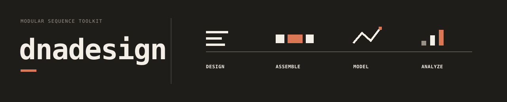

  

`dnadesign` is a collection of modular bioinformatics tools for biological sequence design. It brings dataset management, sequence generation, construct realization, inference, clustering, optimization, and workflow orchestration into one repository.

---

## Documentation

Use the docs index to choose a workflow, inspect existing work, or jump to a tool.

- [Docs index](docs/README.md): main index for workflow, tool, and repository docs.
- [Installation](docs/installation.md): bootstrap the environment and run baseline verification commands.
- [Architecture](ARCHITECTURE.md), [Design](DESIGN.md), [Reliability](RELIABILITY.md), [Security](SECURITY.md), [Plans](PLANS.md), [Quality score](QUALITY_SCORE.md): repository-level contracts and governance records.
- [Developer docs](docs/dev/README.md): CI contracts, maintenance runbooks, and execution-planning references.

---

## Available tools

Use the tool READMEs below for task-specific docs and CLI entrypoints.

| Tool | Description | Coverage |
| --- | --- | --- |
| [**usr**](src/dnadesign/usr/README.md) | Inspect and manage USR datasets and Parquet-backed records. |  |
| [**ops**](src/dnadesign/ops/README.md) | Plan, submit, and inspect batch runbooks across tools. |  |
| [**notify**](src/dnadesign/notify/README.md) | Send webhook notifications for local runs and scheduler-backed jobs. |  |
| [**densegen**](src/dnadesign/densegen/README.md) | Generate DNA sequence libraries from workspace configs and inputs. CLI: `uv run dense`. |  |
| [**infer**](src/dnadesign/infer/README.md) | Run sequence-model inference and write derived outputs back to datasets. |  |
| [**construct**](src/dnadesign/construct/README.md) | Build template-based DNA constructs and record placement metadata. |  |
| [**opal**](src/dnadesign/opal/README.md) | Run active-learning campaigns over labeled sequence datasets. |  |
| [**cluster**](src/dnadesign/cluster/README.md) | Cluster feature tables, render UMAPs, and write analysis outputs. |  |
| [**billboard**](src/dnadesign/billboard/README.md) | Measure regulatory diversity across DenseGen libraries. |  |
| [**libshuffle**](src/dnadesign/libshuffle/README.md) | Subsample libraries iteratively and analyze each round with `billboard`. |  |
| [**nmf**](src/dnadesign/nmf/README.md) | Apply NMF to sequence libraries and summarize recurring TFBS combinations. |  |
| [**latdna**](src/dnadesign/latdna/README.md) | Analyze DNA sequences in latent space. |  |
| [**cruncher**](src/dnadesign/cruncher/README.md) | Optimize sequences against PWM-driven objectives. |  |
| [**tfkdanalysis**](src/dnadesign/tfkdanalysis/README.md) | Analyze TFKD libraries in PPTP-seq context. |  |
| [**aligner**](src/dnadesign/aligner/README.md) | Score global alignments with Biopython `PairwiseAligner`. |  |
| [**baserender**](src/dnadesign/baserender/README.md) | Render sequences through a schema-driven adapter runtime. |  |
| [**permuter**](src/dnadesign/permuter/README.md) | Generate sequence permutations and evaluate downstream outputs. |  |
---
