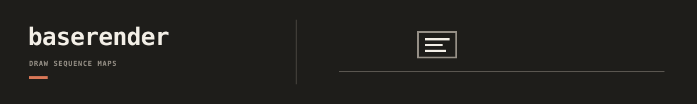

`baserender` turns typed sequence and declared-topology records into
deterministic images. It owns reusable nucleotide layout, annotation, styling,
and image publication. The producing tool still owns metric calculation,
ranking, scientific interpretation, and workflow-specific plots.

## Documentation

- [baserender docs index](docs/README.md): compact route map for reference, integrations, demos, and examples.
- [Technical reference](docs/reference.md): public API, runtime contracts, and renderer surface.
- [Integration contracts](docs/integrations/README.md): tool-specific adapter contracts and expectations, including junction and YIU visual handoffs.
- [Workspace demos](docs/demos/workspaces.md): packaged workspace/job path for validation and rendering.
- [Example jobs](docs/examples): checked-in YAML examples for runnable render inputs.
- [Repository docs index](../../../docs/README.md): repo-wide route map for adjacent tools and workflows.
