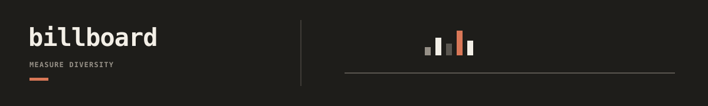

Billboard measures transcription-factor binding-site diversity in generated DNA
libraries and writes compact metric summaries plus diagnostic plots.

## Documentation

- [Billboard docs index](docs/README.md): workflow, metrics, configuration, and
  outputs.
- [Reference](docs/reference.md): detailed metric definitions and example
  configuration.
- [Repository docs index](../../../docs/README.md): cross-tool workflow routing.
