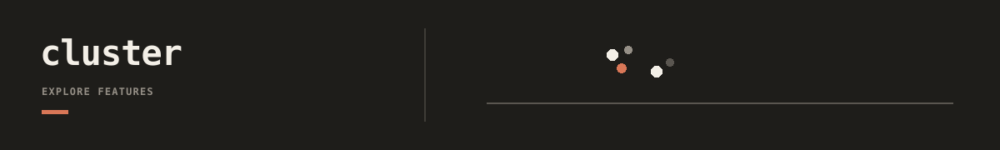

`cluster` is the exploratory downstream surface for unsupervised clustering, UMAP visualization, and related summaries over one chosen feature matrix from a USR dataset or a CSV/Parquet file.
It records reusable outputs in a workspace-scoped artifact root and stays decoupled from upstream feature generation.

## Documentation

- [cluster docs index](docs/README.md): workflow-first route map for exploratory clustering, references, and maintainer verification.
- [cluster docs by type](docs/index.md): workflow, concept, and reference split.
- [Exploratory clustering workflow](docs/workflows/exploratory-clustering.md): first runnable `fit -> umap -> analyze` path once one chosen feature definition exists.
- [cluster CLI contracts](docs/reference/cli-contracts.md): command surface, workspace/preset layout, results policy, and OPAL join contract.
- [cluster verification contract](docs/reference/verification.md): deterministic preflight/run/verify path for package changes.
- [cluster semantic surface](docs/concepts/semantic-surface.md): package nouns, runtime boundaries, and public API surface.
- [Repository docs index](../../../docs/README.md): repo-wide route map for upstream and downstream cross-tool workflows.
