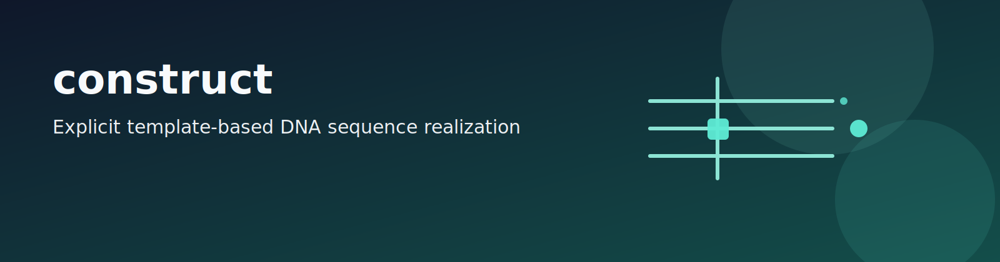

construct takes an input dataset, a template, and explicit placement rules, then writes realized sequences back to USR with `construct__*` lineage.

## Documentation map

1. [Getting started](docs/getting-started.md): shortest path to a validated demo run or blank custom workspace.
2. [Docs overview](docs/README.md): choose the next document by task.
3. [Docs index](docs/index.md): choose the next document by type.
4. [Workspaces guide](workspaces/README.md): scaffold a workspace or copy the packaged demo.
5. [Developer notes](docs/dev/README.md): maintainer notes, internal architecture, and journal entries.

## Primary entrypoints

- `uv run construct --help`
- `uv run construct validate config --config <path> --runtime`
- `uv run construct run --config <path>`
- `uv run construct seed import-manifest --manifest <path>`
- `uv run construct workspace init --id <workspace-id>`
- `uv run construct workspace doctor --workspace <workspace-dir>`

## Package boundary

- `construct` owns sequence realization, placement semantics, and `construct__*` lineage.
- USR owns dataset persistence, dataset ids, and downstream reuse.
- One construct job uses one template plus one or more placed parts.
- Larger studies stay explicit as multiple workspace projects, not one oversized config.
- Packaged workspaces default to workspace-local `outputs/usr_datasets`; shared USR roots are always explicit.
