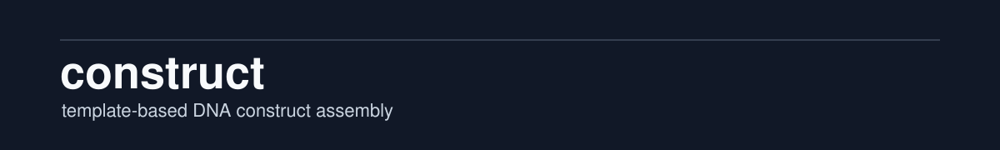

Construct places declared DNA parts into named slots in a sequence context. It
records the realized sequence, each part's span, and its lineage for downstream
tools. The separate `compose` command joins already chosen linear ssDNA
segments; that route is specialized and does not define Construct's general
data model.

## Documentation

- [Construct docs](docs/README.md): first runs, workspaces, references, and cross-tool handoffs.
- [Getting started](docs/getting-started.md): shortest validated path for a demo run or blank custom workspace.
- [Workspace guide](workspaces/README.md): scaffold a blank workspace or copy a packaged demo profile.
- [Template/context contract](docs/reference/template-contexts.md): realized sequence, named spans, lineage, and optional focal-span metadata.
- [Linear ssDNA composition](docs/reference/linear-ssdna-composition.md): specialized composition of already chosen single-stranded segments.
- [Repository docs index](../../../docs/README.md): repo-wide index for cross-tool workflows.
