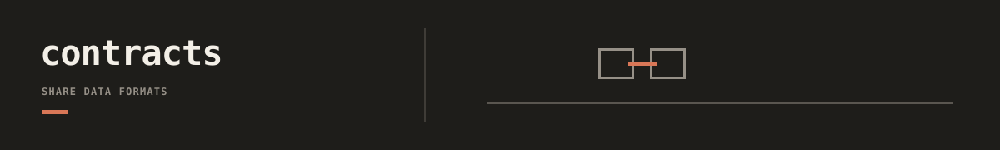

Contracts publishes versioned artifact schemas used when two tools need a
neutral handoff without importing each other's internals.

## Documentation

- [Contracts docs index](docs/README.md): schema families, export catalog, and
  boundary rules.
- [Contract exports](docs/reference/exports.md): public model names and
  domain-qualified handoff policy.
- [External workspace storage](../../../docs/integrations/workspace-storage.md):
  strict storage envelope and validator for private runtime workspaces.
- [Repository docs index](../../../docs/README.md): cross-tool workflow routing.
