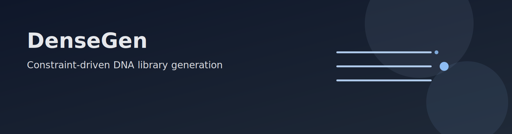

DenseGen wraps the [dense-arrays](https://github.com/e-south/dense-arrays) optimizer to execute full DNA library design workflows from workspace-local configuration and inputs. A run validates strict schema contracts, resolves input sources, builds Stage-A candidate pools when sampling is enabled, executes Stage-B library generation to quota, and writes reproducible artifacts (records, metadata, events, plots, and marimo notebooks) under the workspace `outputs/` tree. The package is designed for maintainable operations: explicit run state, strict fail-fast validation, deterministic path contracts, and direct integration points for downstream USR and Notify workflows.

## Documentation map

1. [Docs overview](docs/README.md): route to tutorials, runbooks, concepts, and references by task.
2. [Workspace catalog](workspaces/catalog.md): choose a packaged workspace and expected inputs before running.
3. [TFBS baseline tutorial](docs/tutorials/demo_tfbs_baseline.md): run the default TFBS workflow end to end.
4. [Sampling baseline tutorial](docs/tutorials/demo_sampling_baseline.md): run the sampling-enabled workflow and outputs.
5. [Constitutive sigma panel tutorial](docs/tutorials/study_constitutive_sigma_panel.md): reproduce a multi-condition sigma study workflow.
6. [Stress ethanol and ciprofloxacin tutorial](docs/tutorials/study_stress_ethanol_cipro.md): run a stress-condition study and inspect resulting artifacts.
7. [DenseGen to USR to Notify tutorial](docs/tutorials/demo_usr_notify.md): execute cross-tool evented flow with USR and Notify.
8. [Quick checklist](docs/concepts/quick-checklist.md): run preflight checks before launching a generation job.
9. [CLI reference](docs/reference/cli.md): command contracts, flags, and failure behavior.
10. [Config reference](docs/reference/config.md): schema and field semantics for run configuration.
11. [Outputs reference](docs/reference/outputs.md): exact artifact paths and data contracts under `outputs/`.
12. [HPC runbook](docs/howto/hpc.md): run DenseGen on remote compute with operational guardrails.
13. [BU SCC run guide](docs/howto/bu-scc.md): BU SCC-specific execution path and submission details.
14. [Architecture notes](docs/dev/architecture.md): internal lifecycle and module boundary map.
15. [Development journal](docs/dev/journal.md): maintainer decisions, investigations, and audit notes.
