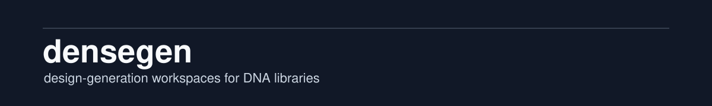
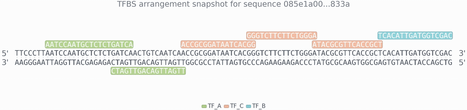

DenseGen wraps the [dense-arrays](https://github.com/e-south/dense-arrays) optimizer to run DNA design workflows from workspace-local configuration and inputs.

It validates input schemas, resolves input sources, builds TFBS candidate pools when sampling is enabled, generates compound sequences until quota is reached, and writes reproducible outputs under the workspace `outputs/` tree.

Use it when you need one design-generation tool with explicit run state, fail-fast validation, deterministic path contracts, and a clean handoff into shared USR workflows.

  

## Start here

- Want a first local run: start with [TFBS baseline tutorial](docs/tutorials/demo_tfbs_baseline.md). Verify next with the [Outputs reference](docs/reference/outputs.md).
- Want to choose a packaged workspace before running: start with the [Workspaces guide](workspaces/README.md). Verify next with the [Config reference](docs/reference/config.md).
- Want the next shared cross-tool step after generation: start with [Promoter Evo2 workflow journey](../usr/docs/operations/promoter-evo2-journey.md). Verify next there once you know whether the study needs source assembly, construct expansion, or infer-derived features.

### Documentation

1. [Docs overview](docs/README.md): route to tutorials, runbooks, concepts, and references by task.
2. [Workspaces guide](workspaces/README.md): choose a packaged workspace and expected inputs before running.
3. [TFBS baseline tutorial](docs/tutorials/demo_tfbs_baseline.md): run the default TFBS workflow end to end.
4. [Sampling baseline tutorial](docs/tutorials/demo_sampling_baseline.md): run the sampling-enabled workflow and outputs.
5. [Constitutive sigma panel tutorial](docs/tutorials/study_constitutive_sigma_panel.md): reproduce a multi-condition sigma study workflow.
6. [Stress ethanol and ciprofloxacin tutorial](docs/tutorials/study_stress_ethanol_cipro.md): run a stress-condition study and inspect resulting artifacts.
7. [DenseGen to USR to Notify tutorial](docs/tutorials/demo_usr_notify.md): execute cross-tool evented flow with USR and Notify.
8. [Quick checklist](docs/concepts/quick-checklist.md): run preflight checks before launching a generation job.
9. [CLI reference](docs/reference/cli.md): command contracts, flags, and failure behavior.
10. [Config reference](docs/reference/config.md): schema and field semantics for run configuration.
11. [Outputs reference](docs/reference/outputs.md): exact artifact paths and data contracts under `outputs/`.
12. [HPC runbook](docs/howto/hpc.md): run DenseGen on remote compute with operational guardrails.
13. [BU SCC run guide](docs/howto/bu-scc.md): BU SCC-specific execution path and submission details.
14. [Architecture notes](docs/dev/architecture.md): internal lifecycle and module boundary map.
15. [Development journal](docs/dev/journal.md): maintainer decisions, investigations, and audit notes.

### Boundary reminder

- DenseGen owns workspace-local generation, schema validation, and reproducible `outputs/` artifacts.
- USR owns durable cross-tool dataset identity once generation results are merged or exported there.
- DenseGen does not own infer feature generation, exploratory clustering, or OPAL active-learning loops.
