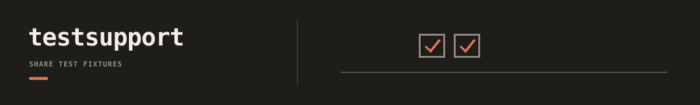

`devtools.tests.support` holds shared repo-level test fixtures for cross-tool contract tests.

This package exists so sibling packages can reuse test helpers without importing
another tool's `tests/` package.

See the [repository docs index](../../../../docs/README.md) for workflow routes and
maintainer references.

Current owned surfaces:

- `usr.py`: shared USR registry fixture helpers used by USR, Infer, LatentDNA, and Ops tests.

Boundary notes:

- `dnadesign.devtools.tests.support` is for test-only helpers.
- Do not import runtime/tool implementation from here in production code.
- Prefer moving shared fixtures here instead of exposing `dnadesign.<tool>.tests.*` across tool boundaries.
