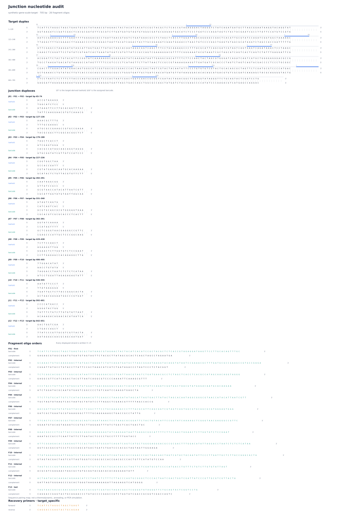

`junction` converts one or more exact linear DNA targets into paired oligo
sequences for Sidewinder-style three-way-junction assembly. A request declares
the target groups, primer sequences, search limits, and order labels. Junction
selects toeholds and barcodes, verifies exact sequence reconstruction, and
writes one reviewable bundle. It does not predict molecular behavior, design
primers, run PCR, or place orders. 

## Documentation

- [Documentation index](docs/README.md): choose a learning, use, reference, or
  operations route.
- [Getting started](docs/getting-started.md): build and verify one gene-scale
  software example.
- [How `junction` works](docs/explanation/how-junction-works.md): learn the
  physical idea, software model, and vocabulary before reading formulas.
- [Prepare a request](docs/guides/prepare-a-request.md): choose assembly groups,
  primers, settings, and order labels explicitly.
- [Inspect and verify](docs/guides/inspect-and-verify.md): find the evidence for
  each review question.
