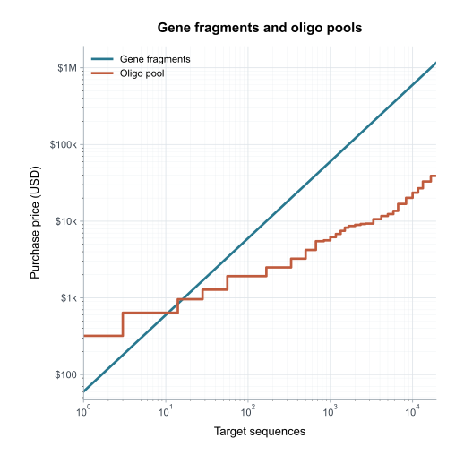

# Choose a synthesis route

Gene fragments and Junction solve different purchasing problems. A gene
fragment arrives as one assembled sequence. Junction plans a target as a set of
short oligos that still require annealing, three-way-junction assembly,
ligation, PCR, and verification.

The example prices 1,000-nt targets against one pool of 36 oligos per target.
Both axes are logarithmic because the supplied pool table spans 2 to 696,000
oligos. The curves show purchase price, not total experimental cost.

## Prefer gene fragments when

- the panel is small;
- an assembled input is worth more than the pool-price difference; or
- the downstream Junction steps have not been established for the use case.

## Consider Junction when

- many related targets share one pool order;
- every physical oligo fits one declared supplier length band; and
- the assembly, recovery, and verification work is acceptable.

The comparison excludes primers, phosphorylation, enzymes, PCR, purification,
cloning, verification, labor, failures, reorders, shipping, and tax. Those costs
can reverse a purchase-price advantage.

The figure assumes resolved A, C, G, and T sequences. The supplied price table
adds 20% to an oligo-pool order that uses `N`; Junction applies that surcharge
when `uses_n_nucleotide` is true in the synthesis scenario.

## Price provenance

The checked figure uses an academic-pricing snapshot retrieved on 2026-08-11
from Twist Bioscience. The machine-readable snapshot is
`junction/economics/data/twist-academic-2026-08-11.yaml`. It includes every
supplied oligo-count tier and all six oligo-length bands. Prices can change;
refresh the snapshot and regenerate the figure before making a purchase.

The comparison uses the Sidewinder assembly geometry described in the
[method sources](../reference/sources.md). It does not predict assembly yield or
experimental success.
