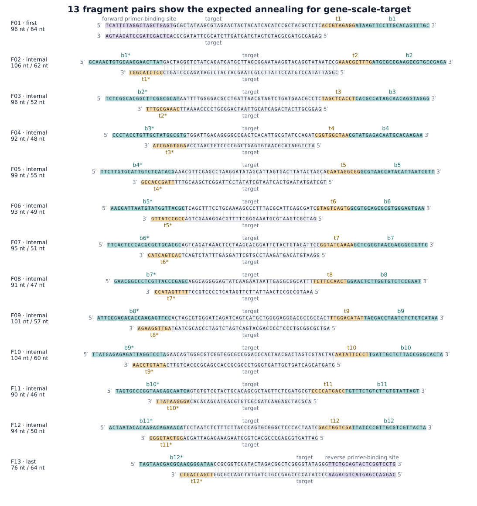
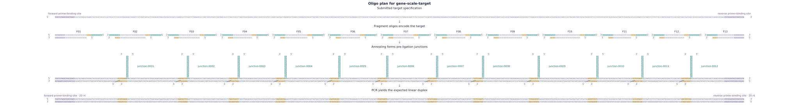
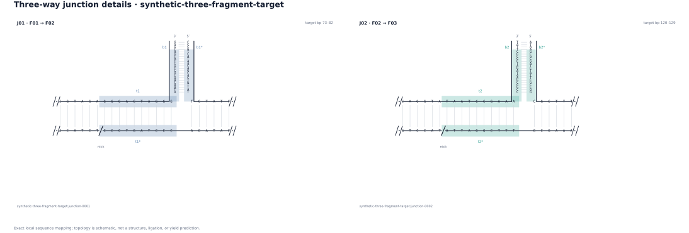

# Inspect and verify a bundle

A bundle is a reproducible design record. Review its evidence in this order.

## Find the answer in the right file

| Review question | File |
| --- | --- |
| What exact input was used? | `request.json` |
| Which assembly groups, loci, toeholds, and barcodes were selected? | `plan.json` |
| Which seeds, budgets, scores, and evaluation counts were used? | `plan.json` → `assembly_groups[].search` |
| Which compact checks passed or remain unresolved? | `checks.json` |
| Which complete strands and primers would be ordered? | `orders/oligos.tsv` |
| What typed evidence can drive optional review plots? | `views/three_way_junction_review.v1.json` |
| Have files changed or stopped reproducing? | `manifest.json` plus `junction verify` |

`checks.json` should always retain an assembly-group-scoped
`thermodynamic_screening: not_run`. It is not a warning that can be converted
to “passed” by string distance alone.

## Verify exact contents

```bash
uv run junction verify <bundle-directory> --format json
```

Verification:

1. opens the expected files without following symlinks and keeps that file view
   stable for the check;
2. rejects extra, missing, moved, or symlinked entries;
3. checks byte lengths and SHA-256 identities;
4. parses the saved request and reruns `dnadesign.junction.string.v1`;
5. renders and compares one expected artifact at a time; and
6. rejects JSON or TSV bytes that differ from the required representation or
   cannot be reproduced.

The verifier intentionally holds at most one rendered artifact payload at a
time. Each renderer still materializes one whole JSON or TSV artifact, so the
per-file limits remain important.

## Read a target plan

For one target, inspect:

- `fragments` for domain spans, strand roles, and complete strand strings;
- `junctions` for target-derived toeholds, external barcodes, and sequence
  complements;
- `recovery` for supplied primer strings and the expected submitted target;
- `reconstructed_target` and `reconstructed_complement` for the exact string
  checks; and
- target-scoped checks for sequence reconstruction, primer terminal matches,
  and the order-length ceiling.

The plan records selected choices and aggregate search evidence. It does not
retain every rejected candidate or a full rejection trace.

## Create optional review images

BaseRender can render each neutral review record as separate, selected views.
Follow the [BaseRender integration](../../../baserender/docs/integrations/junction.md).
Use a new BaseRender output directory beside the source bundle; never add
images inside the verified source bundle.

Use the fragment view to check annealing, the process view to trace oligos into
the expected recovered duplex, and the detail view to inspect selected
`t/t*`, `b/b*`, nick, and strand-end geometry. Light gray guides mark declared
Watson–Crick pairs. Large requests require an explicit bounded selection before
detailed figures are allocated. Search receipts, primers, order rows, and
software checks remain in their JSON or TSV artifacts.

### Expected fragment annealing

[](../assets/annealed-fragments.svg)

This view gives every nucleotide the same physical spacing and aligns paired
bases vertically. The two orderable strands remain antiparallel. Square ends
mark physical oligo termini; light outlines keep the nucleotide glyphs legible.
Categorical fills identify target, toehold, and barcode spans. Unpaired barcode
and toehold arms remain visible instead of being flattened into a target-only
row.

### Planned assembly process

[](../assets/assembly-process.svg)

This view keeps each physical oligo separate before ligation. It shows the
unannealed strands, the pre-ligation junctions with stable IDs, and the exact
primer-extended duplex expected after recovery. The recovered duplex is drawn
at nucleotide resolution in 100 bp windows. Slashes mark continued sequence,
not molecular ends.

### Selected junction details

[](../assets/junction-detail.svg)

This is the most detailed geometry check. Each selected interface has a horizontal
target helix, a perpendicular antiparallel barcode helix, barcode-arm 3′/5′
polarity, break marks on cropped target flanks, the complement-strand nick,
and sequence-derived Watson–Crick edges.

For a request with several targets, BaseRender writes one independently named
figure per target. It does not compress a one-pot pool into a single molecular
canvas. That keeps target identity, junction IDs, coordinates, and exact bases
reviewable while the shared assembly-group evidence remains in `plan.json`.

## Complete downstream review

Before ordering or experimental work, review synthesis feasibility, secondary
structure, crosstalk, end preparation, reaction conditions, primer behavior,
downstream cloning, purchasing, and experimental controls in their owning
workflows.
