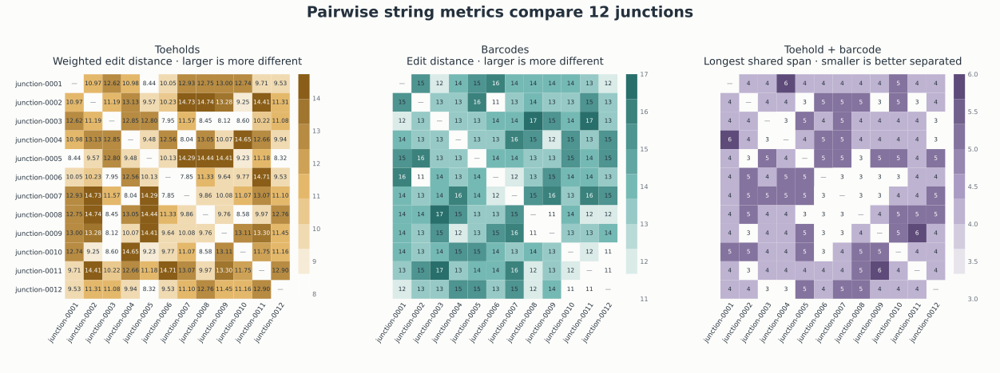

# Inspect and verify a bundle

A bundle records the request, plan, checks, sequence exports, plot data, and
hashes needed to replay a design. Read it in this order.

## Find each answer

| Review question | File |
| --- | --- |
| What exact input was used? | `request.json` |
| Which assembly groups, loci, toeholds, and barcodes were selected? | `plan.json` |
| Which seeds, budgets, scores, and evaluation counts were used? | `plan.json` → `assembly_groups[].search` |
| Which compact checks passed or remain unresolved? | `checks.json` |
| Which complete strands and primers would be ordered? | `orders/oligos.tsv` |
| Which sequences can I pass to another sequence tool? | `sequences/targets.fasta`, `sequences/oligos.fasta`, and `sequences/expected_pcr_products.fasta` |
| What typed evidence can drive optional molecular plots? | `views/three_way_junction_review.v1.json` |
| How different are selected toeholds and barcodes from one another? | `views/junction_sequence_dissimilarity.v1.json` |
| Have files changed or stopped reproducing? | `manifest.json` plus `junction verify` |

`checks.json` should always retain an assembly-group-scoped
`thermodynamic_screening: not_run`. It is not a warning that can be converted
to “passed” by string distance alone.

## Verify exact contents

```bash
uv run junction verify <bundle-directory> --format json
```

Verification:

1. opens the expected files without following symlinks and keeps that file view
   stable for the check;
2. rejects extra, missing, moved, or symlinked entries;
3. checks byte lengths and SHA-256 identities;
4. parses the saved request and reruns `dnadesign.junction.string.v1`;
5. renders and compares one expected artifact at a time; and
6. rejects JSON, TSV, or FASTA bytes that differ from the required
   representation or cannot be reproduced.

The verifier intentionally holds at most one rendered artifact payload at a
time. Each renderer still materializes one whole JSON, TSV, or FASTA artifact,
so the per-file limits remain important.

## Read a target plan

For one target, inspect:

- `fragments` for domain spans, strand roles, and complete strand strings;
- `junctions` for target-derived toeholds, external barcodes, and sequence
  complements;
- `recovery` for supplied primer strings and the expected submitted target;
- `reconstructed_target` and `reconstructed_complement` for the exact string
  checks; and
- target-scoped checks for sequence reconstruction, primer terminal matches,
  and the order-length ceiling.

The plan records selected choices and aggregate search evidence. It does not
retain every rejected candidate or a full rejection trace.

## Read the molecular views

BaseRender reads the molecular review artifact and produces three deterministic
structure views. Follow the [BaseRender integration](../../../baserender/docs/integrations/junction.md).
Use a new BaseRender output directory beside the source bundle; never add
images inside the verified source bundle.

Use the fragment view to check annealing, the process view to trace the input
target through oligos into the expected PCR duplex, and the detail view to
inspect each `t/t*`, `b/b*`, nick, and strand-end geometry. Light gray
guides mark declared Watson–Crick pairs. A target with more than 12 junctions
requires an explicit subset for the detail view. Search receipts, primers,
order rows, and software checks remain in their JSON or TSV artifacts.

### Fragment annealing

[](../assets/annealed-fragments.svg)

This view gives every nucleotide the same physical spacing and aligns paired
bases vertically. The two orderable strands remain antiparallel. Square ends
mark physical oligo termini; light outlines keep the nucleotide glyphs legible.
Categorical fills identify target, toehold, and barcode spans. Unpaired barcode
and toehold arms remain visible instead of being flattened into a target-only
row.

### Assembly path

[](../assets/assembly-process.svg)

This view starts with the submitted target, keeps each physical oligo separate
before ligation, then shows the complete pre-ligation assembly on one
continuous target row and the exact primer-extended duplex expected after PCR.
The PCR duplex remains on one row when the established base spacing fits the
canvas and wraps only when needed. Slashes mark continued sequence, not
molecular ends.

### Junction geometry

[](../assets/junction-detail.svg)

This is the most detailed geometry check. Each interface has a
horizontal target helix, a perpendicular antiparallel barcode helix,
barcode-arm 3′/5′ polarity, break marks on cropped target flanks, the
complement-strand nick, and sequence-derived Watson–Crick edges. Targets with
up to 12 junctions use one grid; larger targets require an explicit subset.

For a request with several targets, BaseRender writes one independently named
figure per target. It does not compress a one-pot pool into a single molecular
canvas. That keeps target identity, junction IDs, coordinates, and exact bases
reviewable while the shared assembly-group evidence remains in `plan.json`.

### Sequence dissimilarity

[](../assets/sequence-dissimilarity.svg)

This Junction-owned assembly-group view shows the same three string comparisons
used by the current search: position-weighted edit distance for toeholds, edit
distance for barcodes, and the longest shared span across each paired
`toehold + barcode` string. The first two panels are better separated at larger
values; the last is better separated at smaller values. These are sequence
comparisons, not a thermodynamic score.

The plotter shows every junction when the group has at most 24. Larger groups
must name a subset of at most 24 `junction_ids`, which bounds pairwise work and
keeps labels readable. The complete group remains in the typed view record,
and the plan retains group-wide minimum, mean, and maximum search summaries.

Generate the optional figure from the request through Junction's public API:

```python
from pathlib import Path

from dnadesign.junction import render_sequence_dissimilarity_svg

Path("sequence-dissimilarity.svg").write_bytes(
    render_sequence_dissimilarity_svg(
        "request.yaml",
        assembly_group_id="assembly-01",
    )
)
```

This diagnostic stays in Junction because it evaluates Junction's own search
metrics. BaseRender remains responsible for reusable nucleotide and topology
views, not statistical analysis.

## Before ordering

Before ordering or experimental work, review synthesis feasibility, secondary
structure, crosstalk, end preparation, reaction conditions, primer behavior,
downstream cloning, purchasing, and experimental controls in their owning
workflows.
