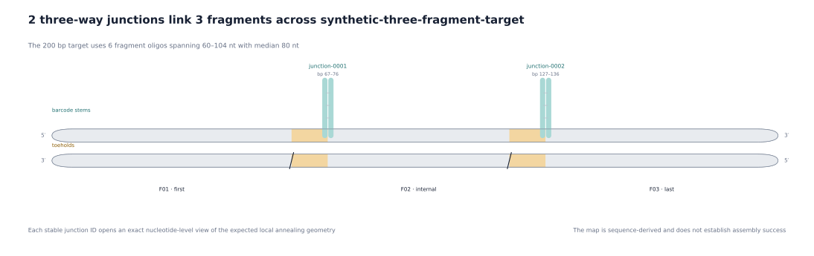

# Inspect and verify a bundle

A bundle is a reproducible software record, not a laboratory acceptance
packet. Review the evidence in this order.

## Find the answer in the right file

| Review question | File |
| --- | --- |
| What exact input was used? | `request.json` |
| Which assembly groups, loci, toeholds, and barcodes were selected? | `plan.json` |
| Which seeds, budgets, scores, and evaluation counts were used? | `plan.json` → `assembly_groups[].search` |
| Which compact checks passed or remain unresolved? | `checks.json` |
| Which complete strands and primers would be ordered? | `orders/oligos.tsv` |
| What typed evidence can drive optional review plots? | `views/three_way_junction_review.v1.json` |
| Have files changed or stopped reproducing? | `manifest.json` plus `junction verify` |

`checks.json` should always retain an assembly-group-scoped
`thermodynamic_screening: not_run`. It is not a warning that can be converted
to “passed” by string distance alone.

## Verify exact contents

```bash
uv run junction verify <bundle-directory> --format json
```

Verification:

1. opens the expected files without following symlinks and keeps that file view
   stable for the check;
2. rejects extra, missing, moved, or symlinked entries;
3. checks byte lengths and SHA-256 identities;
4. parses the saved request and reruns `dnadesign.junction.string.v1`;
5. renders and compares one expected artifact at a time; and
6. rejects JSON or TSV bytes that differ from the required representation or
   cannot be reproduced.

The verifier intentionally holds at most one rendered artifact payload at a
time. Each renderer still materializes one whole JSON or TSV artifact, so the
per-file limits remain important.

## Read a target plan

For one target, inspect:

- `fragments` for domain spans, strand roles, and complete strand strings;
- `junctions` for target-derived toeholds, external barcodes, and sequence
  complements;
- `recovery` for supplied primer strings and the expected submitted target;
- `reconstructed_target` and `reconstructed_complement` for the exact string
  checks; and
- target-scoped checks for sequence reconstruction, primer terminal matches,
  and the order-length ceiling.

The plan records selected choices and aggregate search evidence. It does not
retain every rejected candidate or a full rejection trace.

## Create optional review images

BaseRender can render each neutral review record as separate, selected views.
Follow the [BaseRender integration](../../../baserender/docs/integrations/junction.md).
Use a new BaseRender output directory beside the source bundle; never add
images inside the verified source bundle.

Use the fragment map to check expected strand pairing, the target overview to
locate all interfaces, and junction details to inspect selected `t/t*`,
`b/b*`, nick, and strand-end geometry. Light gray edges mark declared
Watson–Crick pairs. Large requests require explicit fragment or junction
selection before a detailed figure is allocated. Search receipts, primers,
order rows, and software checks remain in their owning JSON or TSV artifacts;
the plots do not duplicate them. A plot adds no thermodynamic or experimental
evidence and is not part of the `junction` plan identity.

### Expected fragment pairing

[](../assets/annealed-fragments.svg)

This view keeps the two orderable strands antiparallel and marks only the
pairing declared by the verified record. The unpaired barcode and toehold arms
remain visible instead of being flattened into a target-only sequence row.

### Target-scale assembly map

[](../assets/assembly-overview.svg)

This symbolic view answers where the interfaces occur. It omits nucleotide
letters on purpose; use it to choose a junction for detailed review.

### Selected junction details

[](../assets/junction-detail.svg)

This is the decisive geometry check. Each selected interface has a horizontal
target helix, a perpendicular antiparallel barcode helix, barcode-arm 3′/5′
polarity, break marks on cropped target flanks, the complement-strand nick,
and source-derived Watson–Crick edges. The view is a deterministic sequence
schematic, not a folding simulation.

## Review before any order or experiment

The owning project must still review synthesis feasibility, secondary
structure, crosstalk, phosphorylation, ligation conditions, primer behavior,
downstream cloning, safety, purchasing, and experimental controls. A verified
bundle only establishes the software contract described above.
