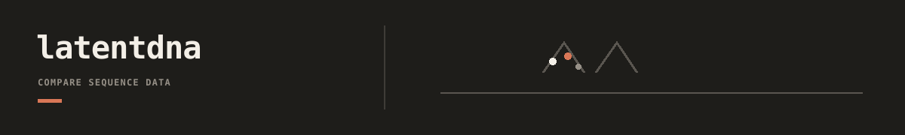

`latentdna` is the artifact-first downstream latent analysis surface for dnadesign. It reads vector-bearing sources, materializes reusable latent-analysis artifacts inside a workspace, and renders plots or exports from those artifacts without taking over infer, USR mutation, or OPAL training loops.

## Documentation

- [latentdna docs](docs/README.md): workflow, reference, concepts, and package routing.
- [Workspaces guide](workspaces/README.md): packaged templates and local workspace scaffolding.
- [CLI contracts](docs/reference/cli-contracts.md): current command surface and machine output contracts.
- [Workspace schema](docs/reference/workspace-schema.md): `latentdna.workspace.v1` core config shape.
- [Source contract](docs/reference/source-contract.md): declared source kinds including `matrix_bundle`.
- [View contract](docs/reference/view-contract.md): source-backed and derived view legality.
- [Deliverable contract](docs/reference/deliverable-contract.md): readiness, outputs, and recipe coupling.
- [Performance budgets](docs/reference/performance-budgets.md): fixture-scale benchmark harness and pressure-path notes.
- [Promoter-study latent atlas workflow](docs/workflows/promoter-study-latent-atlas.md): first tracer-bullet path from USR-backed vectors to persisted plots.
- [Context-shift workflow](docs/workflows/context-shift.md): aligned delta views and scalar QC.
- [Cross-view agreement workflow](docs/workflows/cross-view-agreement.md): structural agreement without raw coordinate mixing.
- [Export to OPAL workflow](docs/workflows/export-opal-x.md): deterministic `X` bundle handoff patterns.
- [Repository docs index](../../../docs/README.md): repo-wide upstream and downstream handoff index.
