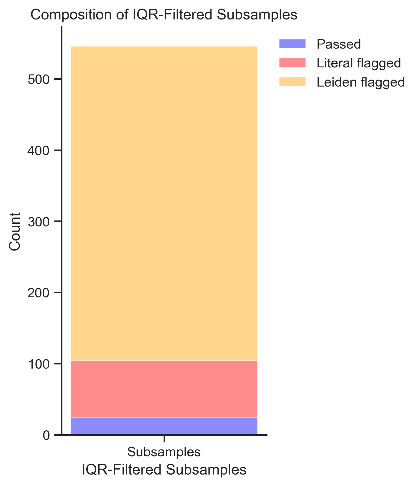
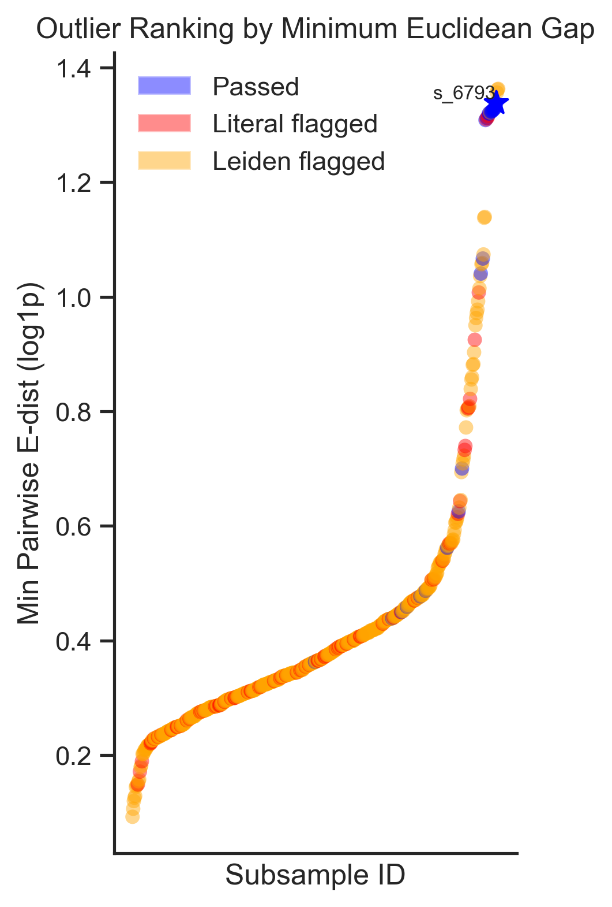
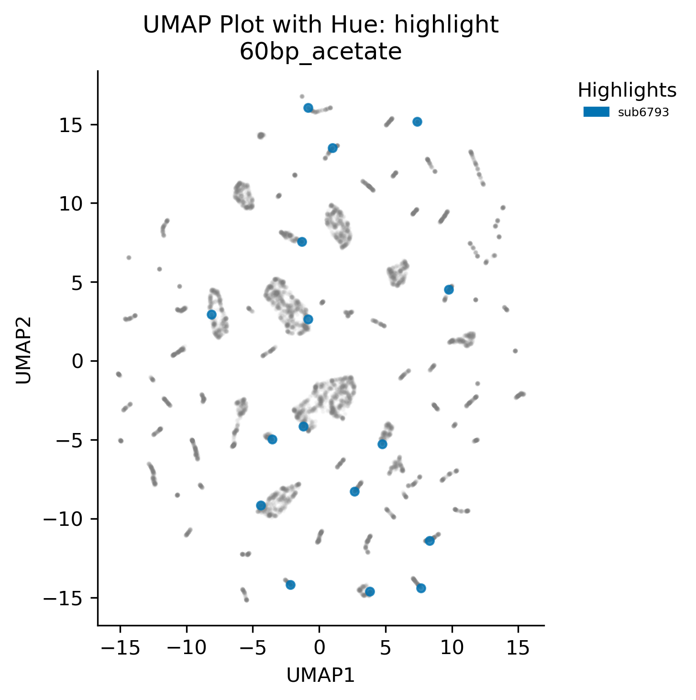

## libshuffle

**libshuffle** is a lightweight subsampling engine designed to identify representative subsets of dense-array DNA sequence libraries by balancing high-dimensional embedding diversity with literal sequence diversity. It builds on the **billboard** pipeline for core metric computation and offers a clear three‐step filtering and ranking process.

### Overview

Given a large pool of sequences, **libshuffle** repeatedly draws fixed‑size subsamples (e.g., 16 sequences), computes diversity metrics in both latent (embedding space) and literal (string) domains, and selects the subsample that best maximizes overall diversity. The pipeline:

1. **Subsampling** via `libshuffle/subsampler.py`
2. **Metric computation** involves two complementary sources:
   - **Latent embeddings**: Pairwise cosine dissimilarity and Euclidean distance computed on Evo2‑derived high‑dimensional embeddings.
   - **Literal annotations**: Core **billboard** metrics (e.g. TFBS richness, Jaccard and Levenshtein dissimilarities) that describe sequence‑part annotations produced by the **densegen** pipeline.

   All metrics are implemented in `libshuffle/metrics.py`.

3. **Visualization** of selection steps (`libshuffle/visualization.py`)
4. **Subsample selection** (`libshuffle/selection.py`)
5. **Output generation** (`libshuffle/output.py`)

---

### Diversity Selection

#### Broad Sweep: Embedding Diversity

> **Goal:** Identify subsamples with high semantic/latent diversity.
> **Plot:** Scatter of *mean pairwise cosine dissimilarity* (x‑axis) vs. *mean pairwise log1p Euclidean distance* (y‑axis).
> **Threshold:** IQR‐based cutoff on the cosine axis isolates the top angular outliers.


### Diversity Quality Control: Dropout Flags

> **Goal:** Filter out subsamples that contain trivially similar sequences at the string level.
> **Flags:** Any subsample containing at least one pair of sequences with zero *Min Jaccard Dissimilarity* (TF Combinatorial Diversity) or zero *Min Motif‑String Levenshtein distance* (Sequence Architectural Diversity) is classified as **literal flagged** (see [**billboard**](../billboard/README.md) for details on these metrics).



> **Note:** We also use a **Leiden flag**, clustering Evo 2 embeddings with the Leiden algorithm (see [**cluster**](../cluster/README.md)). Any subsample that contains more than one sequence from the same cluster is flagged, ensuring we sample across distinct semantic “islands.”

### Outlier Ranking: Minimum‑Gap Selection

> **Goal:** From the embedding‑ and literal‑clean subsamples, select the one with the largest *closest‑pair gap* in Euclidean space.
> **Process:** Compute each outlier’s `min_euclidean` and choose the maximum.
> **Visualization:** Display only the threshold‑passing subsamples, ranked by `log1p(min distance)`.



> **Follow‑up:** Apply UMAP to each sequence’s Evo 2 mean‑pooled embedding (see [**cluster**](../cluster/README.md)) and then overlay the selected subsample onto the full projection—confirming that the chosen library spans the diverse “semantic islands” of the embedding space.




#### **Summary of the selection process:**

We generate many 16‑sequence subsets and first filter for those with high average cosine dissimilarity in Evo2 embedding space. Next, we drop any subset with similar transcription factor compositions—flagging sequence combinations with zero Jaccard or Levenshtein distance and, optionally, excluding those sharing a Leiden cluster. Finally, we rank the survivors by their minimum pairwise Euclidean distance (the closest‑pair gap) and select the subset with the largest gap, thus considering both latent (embedding) and literal (sequence) diversity.


### Installation & Usage

1. **Configure** `configs/example.yaml` under `libshuffle` to point at your `.pt` directory, set subsample size, plot settings, etc.
4. **Run** the pipeline:
   ```bash
   python libshuffle/main.py
   ```
5. **Inspect** output under `libshuffle/batch_results/<prefix>_YYYYMMDD/`.


### Configuration

Key settings in `configs/example.yaml`:

```yaml
libshuffle:
  input_pt_path: "sequences/my_library"
  output_dir_prefix: "run1"
  subsample_size: 16
  num_draws: 1000
  literal_filters: ["jaccard","levenshtein"]
  billboard_core_metrics: [tf_richness, …]
  plot:
    scatter:
      low_alpha: 0.2
      high_alpha: 0.8
      colors:
        base: gray
        literal_drop:
          literal: red
        cluster_drop: slategray
        threshold_line: lightgray
```

### Code Structure

```python
dnadesign/
└── src/
    └── dnadesign/
        ├── configs/             # YAML inputs
        ├── sequences/           # source .pt files
        └── libshuffle/
            ├── main.py          # CLI driver
            ├── config.py        # config loader
            ├── subsampler.py    # draw & cache
            ├── metrics.py       # compute pairwise & billboard metrics
            ├── selection.py     # filter + argmax
            ├── visualization.py # plot scatter, bar, hit‑zone
            └── output.py        # write YAML & .pt
```

### Outputs

- **global_summary.yaml** – configuration + input info
- **sublibraries.yaml** – per‑subsample metrics & pass/fail flags
- **scatter_summary.png** – global library and initial thresholding visualization
- **flag_composition.png** – QC breakdown bar chart
- **hitzone_summary.png** – final outlier ranking
- **selected/** – the final `.pt` of the chosen subsample (if enabled)
