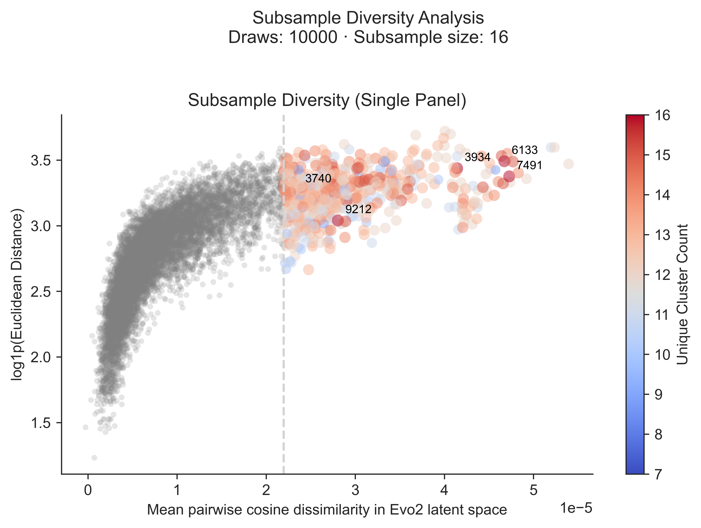

## libshuffle

**libshuffle** iteratively subsamples sequence libraries from the sibling **sequences** directory and computes diversity metrics using the **billboard** pipeline as its engine. The program produces plots while outputting subsamples that best represent overall diversity.

```
dnadesign/
└── src/
    └── dnadesign/
        ├── configs/
        │   └── example.yaml        # Global configuration (includes libshuffle and billboard settings)
        ├── libshuffle/
        │   ├── main.py             # CLI entry point
        │   ├── config.py           # Loads and validates YAML config
        │   ├── subsampler.py       # Implements iterative subsampling and caching
        │   ├── metrics.py          # Computes diversity metrics
        │   ├── visualization.py    # Generates scatter plots and other figures
        │   └── output.py           # Writes summary and detailed YAML outputs
        └── sequences/              # Contains input .pt file (and optionally output .pt files)
```

### Usage

1. **Configure:**  
   Edit the YAML configuration file (e.g., `configs/example.yaml`) to set the input directory, subsample size, metric options, and output naming.

2. **Run the Pipeline:**  
   Execute the main entry point:
   ```bash
   python libshuffle/main.py
   ```

4. **Results:**  
   Outputs—including summaries, visualizations, and optional subsample files—are in the specified output directory under a timestamped folder.

   
