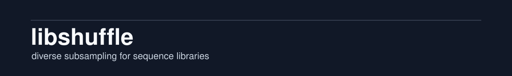

LibShuffle picks representative subsets from dense DNA libraries by combining
embedding diversity with literal sequence-diversity checks.

## Documentation

- [LibShuffle docs index](docs/README.md): selection workflow, inputs, and
  outputs.
- [Selection workflow](docs/selection-workflow.md): metric flow, ranking rules,
  example plots, and configuration.
- [Repository docs index](../../../docs/README.md): cross-tool workflow routing.
