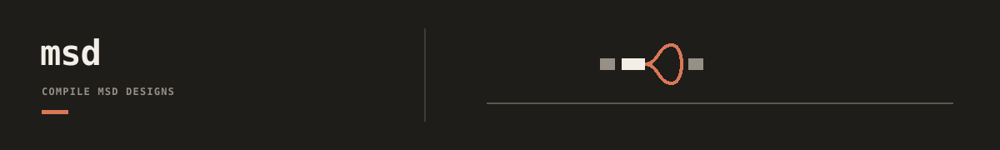

`dnadesign.msd` turns a typed Retron MSD design into one explicit DNA sequence.
It owns reusable parsing, validation, reference resolution, and sequence
assembly. It does not own a study's registry entries, candidate choices,
objectives, or evidence.

## Documentation

- [Compiler contract and example](docs/README.md): understand the boundary,
  resolve a request, and compile one sequence.
