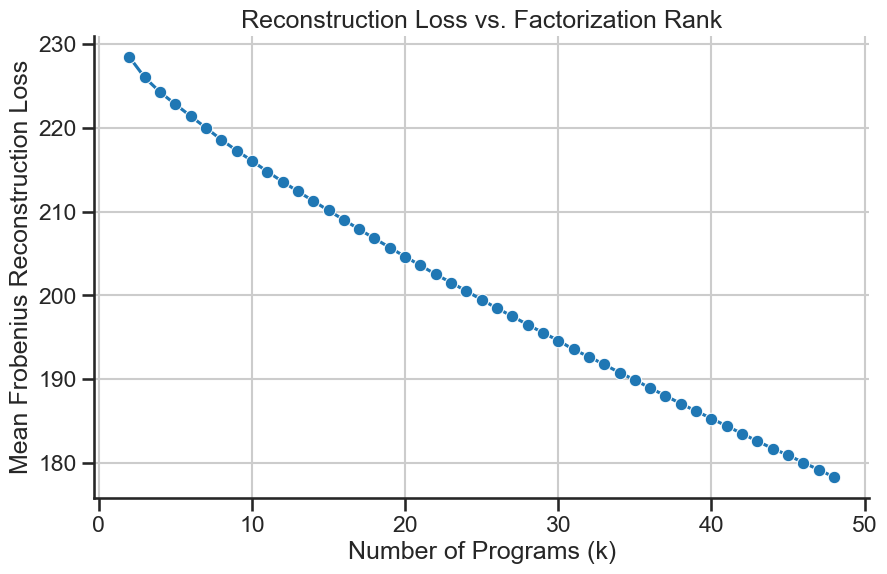
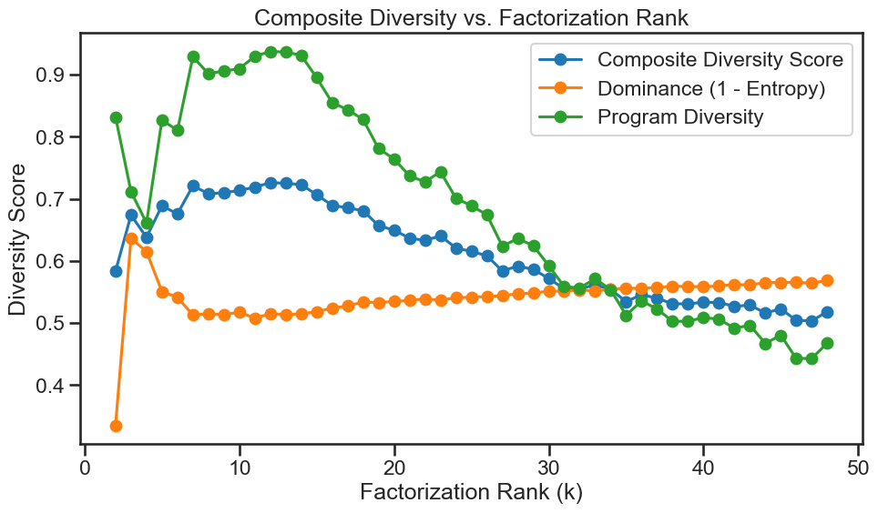
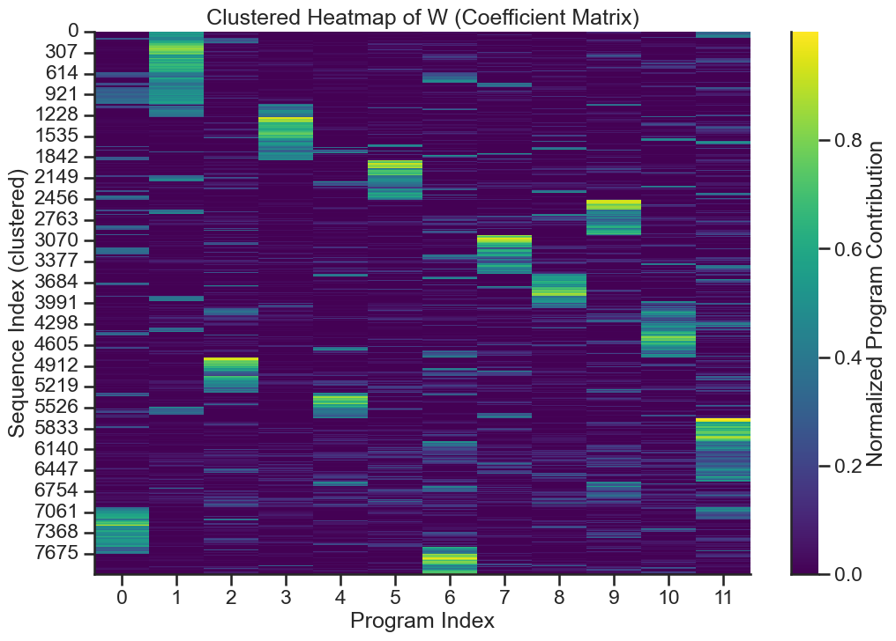
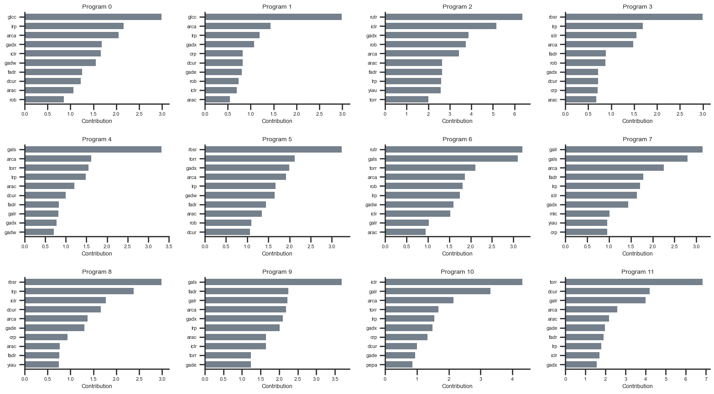

## nmf


**nmf** applies Non-Negative Matrix Factorization (NMF) to dense-array DNA sequences, revealing higher-order **motif combinatoric programs**—groups of transcription factor (TF) motifs that co-occur across a designed library. Unlike simpler metrics (see the **billboard** pipeline), NMF provides a more abstract view of binding site architectures.

```bash
dnadesign/
├── billboard/
├── libshuffle/
├── nmf/
│   ├── __init__.py
│   ├── config.py
│   ├── parser.py
│   ├── encoder.py
│   ├── nmf_train.py
│   ├── diagnostics.py
│   ├── persistence.py
│   ├── utils.py
│   └── main.py                 # Main CLI entry point
├── configs/
│   └── example.yaml
└── sequences/
    └── densebatch_example.pt   # Example .pt file
```

### Background

Dense array libraries generated via uniform sampling of transcription factors and their binding sites are **highly diverse by design**—every sequence is unique, with complex and distinct binding site arrangements.

However, if the goal is to explore how these dense arrays function—such as through DNA synthesis or screening—then some degree of selection becomes inevitable. This introduces the challenge of **representative diversity**: rather than just ensuring uniqueness, we now care about selecting a small set of sequences that reflect distinct, **higher-order combinatorial patterns**. The question becomes: how do you meaningfully choose within an already highly diverse space?

At first glance, it’s natural to lean on classic “billboard” metrics when subsampling dense arrays:
- **TF Richness** — how many unique transcription factors are represented.
- **Inverted Gini** — how evenly motifs are represented across the subsample, reflecting whether certain TFs dominate the overall composition.
- **Jaccard Dissimilarity** — how distinct the combinations of transcription factors are between sequence pairs.

These metrics capture surface-level diversity, but in a **highly diverse by design** library, they offer little contrast. Because TFs and their binding sites are uniformly sampled, nearly all sequences appear equally complex, causing these metrics to flatline: they confirm diversity but fail to stratify it.

NMF identifies recurrent combinations of TF motifs that explain variation across the entire sequence library. These latent programs may reveal hierarchical motif groupings that shallow diversity metrics cannot detect.

  > Each sequence is expressed as a soft mixture over programs (`W`), and each program is defined as a weighted set of TF motifs (`H`).

### Pipeline

The pipeline takes as input:

  - A `.pt` file with the sibling **sequences** directory, containing a list of sequence dictionaries, each with motif-level data in `meta_tfbs_parts_in_array`.
  - A YAML config specifying NMF hyperparameters, rank range, and visualization flags.

    ```yaml
    # configs/example.yaml
    nmf:
      batch_name: "densebatch_test"
      k_range: [8, 21]
      encoding_mode: "motif_occupancy"
      max_motif_occupancy: 5
      normalize_coefficients: true
      clip_h_max: 3.0
      plots:
        generate_heatmaps: true
        generate_motif_barplots: true
        generate_riverplot: true
        generate_sequence_program_composition: true
      clustering:
        enable_w_clustering: true
        linkage_method: "ward"
      stability_metrics:
        enable: true
        similarity_threshold: 0.6
    ```

#### Program Execution
  ```python
  python nmf/main.py
  ```

#### Motif-Centric Encoding
  - The pipeline constructs a feature matrix `X` where rows represent sequences in the library and columns represent individual TF motifs found in the sequence.

#### Decomposing factor `X` into two non-negative matrices:
  - `X ≈ W × H`,
  where:
  - W (sequences × programs)
    - Each row is a program composition vector, expressing how a sequence draws from the learned regulatory programs.
  - H (programs × motifs)
    - Each row defines a latent program as a weighted combination of motifs that frequently co-occur.

This decomposition can reveal TFBS combinatorics underlying the design space.


### Composite Diversity Score (CDS)

NMF is parameterized by a rank `k`, which determines the number of latent regulatory programs to learn. Conceptually, `k` reflects the programmatic richness assumed in the dataset.

Because our input sequences are densely encoded with many transcription factor motifs by design, increasing `k` consistently improves reconstruction fidelity (i.e., Frobenius error decreases monotonically). This makes elbow-point heuristics unreliable—the sequences are simply too rich for a clear elbow.

  

Alternatively, we introduced a **Composite Diversity Score (CDS)** to select `k`. This metric balances two competing goals:
- Dominance — how clearly each sequence favors a single program (i.e., low entropy).
- Program Diversity — how broadly the subsample of sequences spans different programs.

  ```python
  CDS(S) = α · [1 - (1 / (|S| · log₂(k))) · Σ H(s)] + (1 - α) · [D_inv(S) / k]
  ```
where:
- H(s) is the normalized entropy of sequence s’s program vector (from the NMF W matrix).
- D_inv(S) is the inverse Simpson index over the dominant programs in subsample S.
- k is the number of latent programs (NMF rank).
- α ∈ [0,1] (default: 0.5) balances per-sequence clarity vs. global program coverage.

We compute CDS across a range of k values and select the one that maximizes it—representing the best tradeoff between interpretability and diversity.

  

In the above example, k = 12 achieved the highest CDS. We then reused the corresponding NMF decomposition (W, H) for all downstream analyses and subset evaluations.


### Outputs
- A results directory `nmf/batch_results/<batch_name>` containing:
  - W.csv and H.csv for each k, plus a metrics.yaml detailing reconstruction error, replicate losses, etc.
  - Diagnostic plots (e.g. W_heatmap.png, H_heatmap.png, top_motifs_grid.png, signature_stability_riverplot.png).
- Each sequence dictionary in the original .pt file gets an annotated meta_nmf key:
  ```bash
  "meta_nmf": {
    "k_used": 12,
    "program_composition": [ ... ],
    "dominant_program": 0,
    "program_entropy": 0.13
  }
  ```

Check `nmf/batch_results/<batch_name>` for CSVs, metrics, and plots. Sequences in your .pt file now have a `meta_nmf` object capturing the final factorization details.

#### Example Visualizations

- W & H Heatmaps: Show each sequence’s distribution of programs (W) and each motif’s program usage (H).

- Motif Barplots: Summarize top motifs that define each program.

