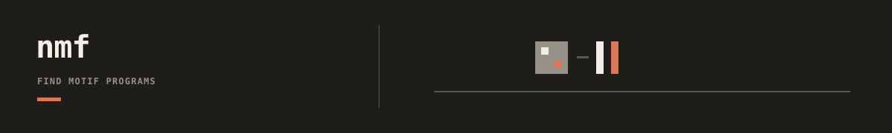

NMF factors motif-occupancy tables from dense-array libraries into recurring
motif programs for downstream review.

## Documentation

- [NMF docs index](docs/README.md): factorization workflow, inputs, and outputs.
- [Factorization workflow](docs/factorization-workflow.md): model rationale,
  configuration, diagnostics, and result artifacts.
- [Repository docs index](../../../docs/README.md): cross-tool workflow routing.
