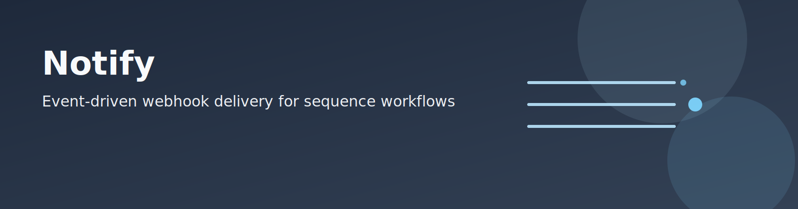

Notify is the observer-plane package that watches Universal Sequence Record events and sends selected notifications to webhook providers.

For cross-tool routing, start at the [repository docs index](../../../docs/README.md).

## What belongs here

- Package-level architecture map for `dnadesign.notify`.
- Maintainer code boundaries and extension points.
- Pointers to canonical operator runbooks.

This page is not the long-form operator manual.

## Directory layout

- `cli/`: CLI package boundary.
- `cli/__init__.py`: router-only Typer app/group wiring.
- `cli/bindings/`: dependency surface and registration modules (`deps`, `registry`) plus command binding adapters (`send`, `profile`, `setup`, `runtime`).
- `cli/commands/`: Typer option declarations and command registration.
- `cli/commands/profile/`: profile command registration modules (`init_cmd`, `wizard_cmd`, `show_cmd`, `doctor_cmd`).
- `cli/commands/setup/`: setup command registration modules (`slack_cmd`, `webhook_cmd`, `resolve_events_cmd`, `list_workspaces_cmd`).
- `cli/handlers/`: command execution handlers (`send`) and command-scoped packages (`profile/`, `setup/`, `runtime/`).
- `cli/resolve.py`: shared CLI option resolution helpers.
- `delivery/`: webhook transport, payload construction, webhook validation, and secret-backend logic.
- `events/`: tool events-source resolution and event transform logic.
- `profiles/`: profile schema, setup/profile flows, workflow policy, workspace-name resolution, and flow submodules.
- `runtime/`: watch/spool runners, watch loop primitives, cursor primitives, and spool primitives.
- `tool_events/`: tool-event pack registration, evaluation state, and DenseGen handler submodules.
- `providers/`: provider-specific payload formatting.
- `tests/`: unit/integration/contract coverage for CLI/runtime/docs boundaries.

## Read order

1. Operator runbook (canonical): [docs/notify/usr-events.md](../../../docs/notify/usr-events.md)
2. Docs index route map: [docs/notify/README.md](../../../docs/notify/README.md)
3. Module-local quick operations page: [docs/usr-events.md](docs/usr-events.md)
4. DenseGen integration walkthrough: [DenseGen -> USR -> Notify demo](../densegen/docs/tutorials/demo_usr_notify.md)

## Maintainer architecture map

Command surface:
- `src/dnadesign/notify/cli/__init__.py`: thin Typer router and command-group registration.
- `src/dnadesign/notify/cli/bindings/__init__.py`: binding surface used by CLI handlers and tests.
- `src/dnadesign/notify/cli/bindings/deps/`: exported dependency surface for handler injection and test patch points, organized by domain (`profile`, `setup`, `runtime`, `send`).
- `src/dnadesign/notify/cli/bindings/registry.py`: command registration wiring for CLI groups.
- `src/dnadesign/notify/cli/commands/`: CLI option/command registration modules.
- `src/dnadesign/notify/cli/commands/profile/`: profile command registration modules.
- `src/dnadesign/notify/cli/commands/setup/`: setup command registration modules.
- `src/dnadesign/notify/cli/handlers/`: command execution implementations.
- `src/dnadesign/notify/cli/handlers/profile/`: per-command profile handlers (`init_cmd`, `wizard_cmd`, `show_cmd`, `doctor_cmd`).
- `src/dnadesign/notify/cli/handlers/setup/`: per-command setup handlers (`slack_cmd`, `webhook_cmd`, `resolve_events_cmd`, `list_workspaces_cmd`).
- `src/dnadesign/notify/cli/handlers/runtime/`: per-command runtime handlers (`watch_cmd`, `spool_cmd`).

Event-source and policy boundaries:
- `src/dnadesign/notify/events/source.py`: tool resolver registry.
- `src/dnadesign/notify/events/source_builtin.py`: built-in resolvers (`densegen`, `infer_evo2`).
- `src/dnadesign/notify/profiles/flow_events.py`: setup event-source resolution (`--events` vs resolver mode).
- `src/dnadesign/notify/profiles/flow_webhook.py`: webhook secret-source selection and secure ref storage.
- `src/dnadesign/notify/profiles/flow_profile.py`: profile path defaults and profile payload materialization.
- `src/dnadesign/notify/profiles/workspace.py`: workspace-name to config-path resolver registry.
- `src/dnadesign/notify/profiles/policy.py`: policy defaults and profile-path defaults.

Event transformation and tool-specific logic:
- `src/dnadesign/notify/events/transforms.py`: status/message/meta transforms for USR events.
- `src/dnadesign/notify/tool_events/core.py`: tool-event evaluator registry.
- `src/dnadesign/notify/tool_events/packs_builtin.py`: built-in tool-event pack installers.
- `src/dnadesign/notify/tool_events/densegen.py`: DenseGen pack registration surface.
- `src/dnadesign/notify/tool_events/densegen_metrics.py`: DenseGen health metric extraction and gating.
- `src/dnadesign/notify/tool_events/densegen_messages.py`: DenseGen status/message rendering.
- `src/dnadesign/notify/tool_events/densegen_eval.py`: DenseGen per-run emission state machine.

Delivery/runtime primitives:
- `src/dnadesign/notify/runtime/runner.py`: public runner exports for watch/spool orchestration.
- `src/dnadesign/notify/runtime/watch_runner.py`: watch command orchestration entrypoint.
- `src/dnadesign/notify/runtime/watch_runner_contract.py`: watch CLI contract validation and option coercion.
- `src/dnadesign/notify/runtime/watch_runner_resolution.py`: profile/events/webhook source resolution helpers.
- `src/dnadesign/notify/runtime/watch_events.py`: event parsing, event filtering, and payload preparation helpers.
- `src/dnadesign/notify/runtime/watch_delivery.py`: dry-run output and live delivery/spool outcome helpers.
- `src/dnadesign/notify/runtime/spool_runner.py`: spool drain runtime orchestration.
- `src/dnadesign/notify/runtime/cursor/`: cursor lock, offset, and iteration primitives.
- `src/dnadesign/notify/runtime/watch.py`: event-loop execution and delivery hooks.
- `src/dnadesign/notify/runtime/spool.py`: spool write/private-dir operations.
- `src/dnadesign/notify/delivery/http.py`: webhook HTTP posting.
- `src/dnadesign/notify/delivery/secrets/`: secret reference contracts plus keyring/file/shell backend operations.
- `src/dnadesign/notify/delivery/payload.py`: payload construction.
- `src/dnadesign/notify/delivery/validation.py`: webhook source/URL/TLS validation.
- `src/dnadesign/notify/providers/`: payload adapters for `generic`, `slack`, and `discord`.

Module import contract:
- Use canonical subpackage paths (`delivery/*`, `events/*`, `profiles/*`, `tool_events/*`) for runtime code and tests.
- Top-level legacy module aliases are not part of the supported import surface.

## Observer contract

Notify is an observer control plane:
- it does not launch tool runs
- it does not mutate tool command-line arguments, environment variables, or runtime behavior
- it only resolves where Universal Sequence Record events are expected and watches that stream

Input/output boundary contract:
- input stream is Universal Sequence Record `"<dataset>/.events.log"` JSONL
- Notify treats Universal Sequence Record events as an external, versioned contract
- without `--profile`, choose exactly one webhook source:
  - `--url`
  - `--url-env`
  - `--secret-ref`
- profile schema contract is `profile_version: 2`
- default profile privacy is strict (`include_args=false`, `include_context=false`, `include_raw_event=false`)

Default artifact placement (resolver mode):
- `<config-dir>/outputs/notify/<tool>/profile.json`
- `<config-dir>/outputs/notify/<tool>/cursor`
- `<config-dir>/outputs/notify/<tool>/spool/`

## Key boundary reminder

Notify reads Universal Sequence Record `<dataset>/.events.log` and does not consume DenseGen runtime telemetry (`outputs/meta/events.jsonl`).
