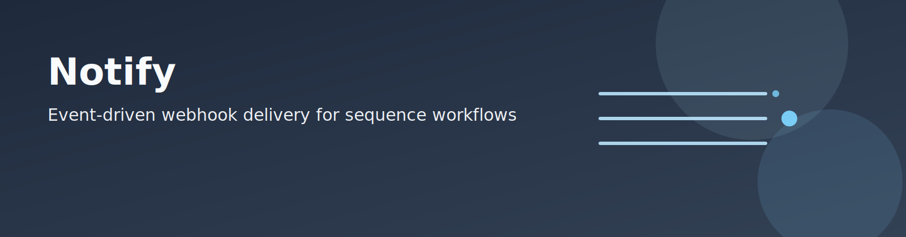

Notify watches Universal Sequence Record events and sends webhook notifications with strict fail-fast contracts.
Use it when you need reliable status delivery from local workspaces or scheduler-managed runs without adding hidden runtime state or fallback behavior.

For cross-tool routing, start at the [repository docs index](../../../docs/README.md).

## Documentation map

Read in this order for progressive disclosure:

1. [Notify docs index](docs/README.md): comprehensive table of contents for Notify workflows, references, and maintainer internals.
2. [Notify USR events runbook](../../../docs/notify/usr-events.md): day-to-day setup, watch, and recovery commands for operator workflows.
3. [Notify operations route](../../../docs/notify/README.md): repository-level task router for local watchers, recovery, and cross-tool operations.
4. [Reference index](docs/reference/README.md): strict command, profile, and boundary contracts to confirm behavior before automation.
5. [Maintainer architecture map](docs/dev/architecture.md): package module map and extension seams for command/runtime changes.
6. [BU SCC batch + notify](../../../docs/bu-scc/batch-notify.md): scheduler-oriented execution path for cluster submission and verification.
7. [Repository docs index](../../../docs/README.md): cross-tool workflow lanes that connect DenseGen, USR, Infer, and Notify.

## Entrypoint contract

- Audience: Notify operators and maintainers working in this package.
- Prerequisites: workspace config and one webhook source (`--url`, `--url-env`, or `--secret-ref`).
- Verify next: [watch command contract](docs/reference/command-contracts.md#notify-usr-events-watch).

## Boundary reminder

Notify consumes Universal Sequence Record `<dataset>/.events.log` and does not consume DenseGen runtime telemetry (`outputs/meta/events.jsonl`).
