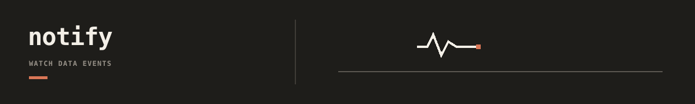

Notify watches Universal Sequence Record events and sends webhook notifications for local workspaces or scheduler-managed runs.

## Documentation

- [notify docs index](docs/README.md): package docs for tool workflows, reference pages, and maintainer internals.
- [Notify USR events runbook](../../../docs/notify/usr-events.md): main setup, watch, recovery, and explicit `--events` guide.
- [Notify operations route](../../../docs/notify/README.md): repository-level docs for watcher workflows and cross-tool handoffs.
- [Reference index](docs/reference/README.md): strict command, profile, and boundary contracts.
- [Maintainer architecture map](docs/dev/architecture.md): package module map and extension seams.
- [Repository docs index](../../../docs/README.md): repo-wide docs index for cross-tool workflows.
