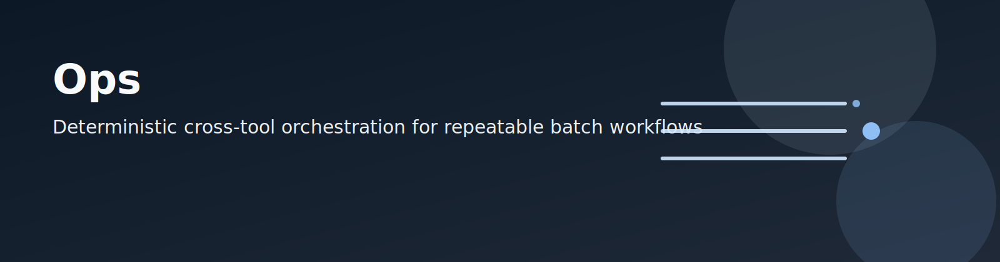

Ops is the cross-tool orchestration control plane for deterministic batch workflows. It compiles runbook intent into explicit preflight, verification, and submit phases with auditable outputs.

Use Ops when you need repeatable scheduler handoffs across producer and observer tools while preserving workspace-scoped logging and fail-fast contracts.

For repository-wide routing, start with the [repository docs index](../../../docs/README.md).

## Documentation map

Read in this order:

1. [Ops operations index](../../../docs/operations/README.md): task-first router for runbook lifecycle choices.
2. [Orchestration runbooks](../../../docs/operations/orchestration-runbooks.md): runbook schema, command sequence, and contract rules.
3. [Packaged runbook precedents](runbooks/presets): checked-in starter runbooks for common orchestration routes; keep run-specific variants in `<workspace-root>/outputs/logs/ops/runbooks/`.
4. [Repository docs index](../../../docs/README.md): cross-tool routes that connect Ops with workload and storage tools.

## Entrypoint contract

1. Audience: operators and maintainers executing deterministic scheduler workflows through runbooks.
2. Prerequisites: valid runbook YAML, scheduler client access (`qsub`, `qstat`), and file-backed webhook secret when notify is enabled (`<webhook_env>_FILE` or an existing profile webhook `secret_ref` that resolves to `file://...`).
3. Verify next: [2-minute dry-run path](../../../docs/operations/orchestration-runbooks.md#2-minute-dry-run-path).

## Boundary reminder

Ops owns orchestration contracts and command ordering. Tool-specific workflow semantics stay in workload and notifier docs, and storage semantics stay in USR contracts.
