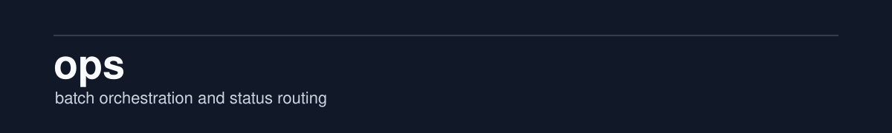

Ops manages batch orchestration across tools. It turns a runbook into preflight, verification, and submit steps with audit output, so scheduler work stays readable instead of turning into ad hoc shell commands.
If you do not know a route id yet, start with `uv run ops catalog list --simple`.
Study-family status and preflight implementations do not live in OPS core; the
active stress-promoter study adapter and its runtime helpers live under
`src/dnadesign/studies/promoter/`, while OPS keeps the
neutral CLI, registry loading, path semantics, orchestration, and rendering
surfaces.
Treat the command families as three neutral surfaces: `ops catalog` is the
discovery plane, `ops progress` is the observation plane, and `ops runbook` is
the control plane for deterministic batch execution.

Use Ops when:
- you need a shared orchestration layer for scheduler work, packaged runbooks, or read-only status over a registered route
- you want to browse the shared command index from the terminal with `uv run ops catalog list --simple` or `uv run ops catalog list`

Do not use Ops when:
- a tool already owns the durable dataset mutation, such as Construct -> USR -> Infer shared-dataset work
- you need the boundary-local runtime semantics first; start from the tool docs or shared USR workflow docs, then return to Ops if you need orchestration around that route

For repo-wide runbook discovery, start with `docs/runbooks/README.md`; `ops` does not keep a second registry.
Use this README for package scope, the shared command entrypoints below, and links into the maintained Ops docs.

## Common entrypoints

- `uv run ops catalog list --simple`: start with a quick inventory from the shell.
- `uv run ops catalog show <registry-id>`: inspect one registered route, its owner docs, and related procedures.
- `uv run ops progress explain <registry-id>`: print the required flags before you use a status surface.
- Use [How to use Ops](docs/how-to-use-ops.md) for the expanded command ladder and [Ops orchestration index](../../../docs/operations/README.md) once you are in the runbook lifecycle.

## Documentation

- [Ops docs index](docs/README.md): Ops package docs, packaged presets, and links to repo-level control-plane docs.
- [How to use Ops](docs/how-to-use-ops.md): command guide for catalog discovery, runbook inspection, status checks, and manifest scaffolding.
- [Runbook catalog](../../../docs/runbooks/README.md): repo-level command index for cross-tool procedures and tool entrypoints.
- [Ops orchestration index](../../../docs/operations/README.md): runbook lifecycle docs for init, plan, execute, and status checks.
- [Orchestration runbooks](../../../docs/operations/orchestration-runbooks.md): runbook schema, command sequence, and contract rules.
- [Packaged runbook presets](runbooks/presets): checked-in starter runbooks for common orchestration routes.
- [Repository docs index](../../../docs/README.md): repo-wide docs index for cross-tool workflows.
