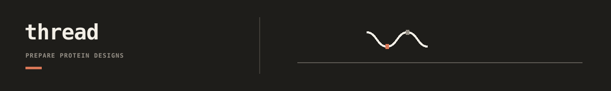

`dnadesign.thread` provides reusable contracts for protein candidates,
structure results, annotations, and fold checks. It connects to named tools
through adapters, but it does not own a study's masks, thresholds, rankings, or
scientific interpretation.

## Documentation

- [Thread docs index](docs/README.md): current public surfaces and boundaries.
- [Repository docs index](../../../docs/README.md): repo-wide workflow routing.

## Choose a surface

| Need | Public package |
| --- | --- |
| Prepare or normalize a fixed-backbone design run | `dnadesign.thread.adapters.proteinmpnn` |
| Normalize accepted design samples into candidate rows | `dnadesign.thread.candidates` |
| Parse completed fold outputs | `dnadesign.thread.adapters.colabfold` |
| Define fold-check requests and reports without choosing a backend | `dnadesign.thread.foldcheck` |
| Record model-predicted structure provenance | `dnadesign.thread.structure_predictions` |
| Normalize protein annotations | `dnadesign.thread.adapters.esm_atlas` or `.biohub_esmc` |
| Inspect an existing structure interactively | `dnadesign.thread.structure_views` |

Backends execute only through explicit adapter calls. Thread never selects
subjects, invents biological replicate identity, chooses an objective, or
promotes a candidate. Those decisions stay with the caller that owns the
study.
